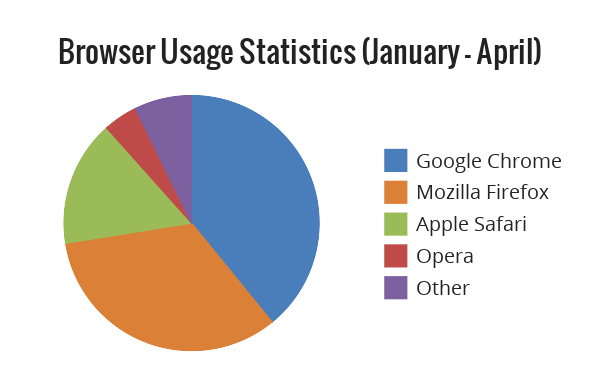

PieChart
========

A reasonably efficient* class for drawing pie charts with ImageMagick or GD in PHP. Intended as a 
learning exercise for using the NetBeans IDE and the Xdebug profiler and debugger. The code is 
available under the [GNU GPL v3.0](http://www.gnu.org/licenses/gpl-3.0.html), so feel free to use it
with attribution. I recommend using the Imagick version, `PieChartImagick` over the GD version,
 `PieChartGD`.

### Demonstration ###
Below is the code required to generate a pie chart and echo it to the client's browser. The example 
uses the method `outputPNG()` to tell the browser to render the image. Alternatively, the function 
`forceDownloadPNG()` can be used to instruct the browser to bring up the save dialog.

#### Code ####
````php
<?php
require 'PieChartImagick.php';

$width  = 600;
$height = 375;
$title = 'Browser Usage Statistics (January - April)';
 
$chart = new PieChartImagick($width, $height);

$chart->setTitle($title, 'fonts/Oswald/Oswald-Regular.ttf');

$chart->addSlice('Google Chrome',   27, '#4A7EBB');
$chart->addSlice('Mozilla Firefox', 23, '#DA8137');
$chart->addSlice('Apple Safari',    11, '#9BBB59');
$chart->addSlice('Opera',            3, '#BE4B48');
$chart->addSlice('Other',            5, '#7D60A0');

$chart->draw();
$chart->outputPNG('Browser Statistics 2012 Q1.png');
````
#### Output ####


*This example took 150ms to execute on my laptop (i3-350M @ 2.27 GHz).
